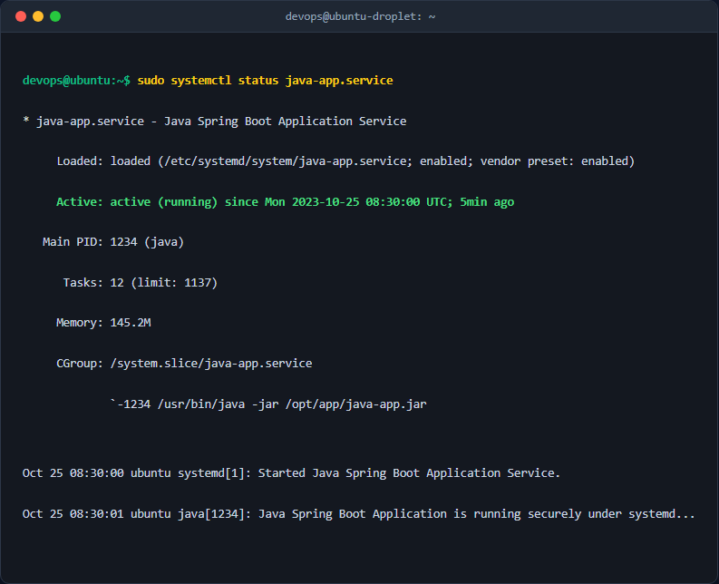

# Bài 5: Thiết kế và Cấu hình dịch vụ Systemd Service cho ứng dụng Java

## 1. Mục tiêu & Bối cảnh kỹ thuật
Tóm tắt yêu cầu và môi trường thực hiện:
- Quản lý vòng đời ứng dụng Spring Boot tự động bằng Systemd.
- Cấu hình chạy ứng dụng dưới quyền một user giới hạn (non-root) tên là `java-runner` để nâng cao bảo mật hệ thống.
- Cài đặt chính sách tự động khởi động lại dịch vụ sau 10 giây khi tiến trình bị sập bất thường (`on-failure`).

## 2. Các bước thực hiện chi tiết

### Bước 1: Tạo tài khoản người dùng hệ thống không có quyền đăng nhập shell
Chạy lệnh sau trên terminal Linux:
```bash
sudo useradd -r -s /usr/sbin/nologin java-runner
```
*Giải thích các cờ:*
- `-r`: Tạo system account (UID/GID nhỏ hơn, thường dùng cho các dịch vụ daemon).
- `-s /usr/sbin/nologin`: Khóa quyền đăng nhập shell của tài khoản này nhằm đảm bảo an toàn bảo mật.

### Bước 2: Tạo tệp cấu hình dịch vụ Systemd
Soạn thảo tệp cấu hình dịch vụ tại đường dẫn `/etc/systemd/system/java-app.service`:
```ini
[Unit]
Description=Java Spring Boot Application Service
After=network.target

[Service]
User=java-runner
ExecStart=/usr/bin/java -jar /opt/app/java-app.jar
Restart=on-failure
RestartSec=10

[Install]
WantedBy=multi-user.target
```

### Bước 3: Nạp lại cấu hình và khởi động dịch vụ
```bash
sudo systemctl daemon-reload
sudo systemctl start java-app.service
sudo systemctl enable java-app.service
```

## 3. Kiểm tra & Xác thực kết quả
Thực hiện kiểm tra trạng thái dịch vụ:
```bash
sudo systemctl status java-app.service
```



## 4. Kết luận & Best Practices bảo mật vận hành
- Việc sử dụng `User=java-runner` giúp cô lập tiến trình ứng dụng, ngăn chặn việc kẻ tấn công chiếm toàn quyền root nếu ứng dụng Java có lỗ hổng RCE.
- Cấu hình `Restart=on-failure` với `RestartSec=10` đảm bảo tính sẵn sàng cao (High Availability) cho hệ thống khi gặp sự cố đột ngột.